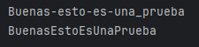

# ✨String to Camel Case✨

| 📝 **Nota** | Esto es la resolución de un ejercicio. Por favor, intente resolverlo antes. |
|-------------|-----------------------------------------------------------------------------|

## 🏷️ || Descripción
Este código sacado de un kata de codewars. Consiste en tomar una String por parámetro y devolver una String en Camel Case. Ideal para practicar Strings.


## 🌟 || Ejemplos
Entrada: `hola-Don_pepito`  
Salida: `HolaDonPepito`



---
---
---


## ⌨️ || Instalación


```bash
1. Clona el repositorio: `git clone https://github.com/EvelynSherlyn/KataLV6-StringToCamelCase.git`
2. Importa el proyecto en tu IDE, en este caso IntelliJ.
```
    
## 💟 || Versión
- [X]   V1.4.1 - Documentación ampliada
- [ ]   ~~V1.2 - Readme~~
- [ ]    ~~V1.1 - Documentación + JavaDoc~~
- [ ]    ~~V1.0 - Versión funcional~~
## 📚 || Documentación
El Javadoc generado está disponible en el directorio `/docs` del repositorio. En el se encuentra información sobre la clase `Solution` y su método principal `toCamelCase`. Además de los parámetros, retornos... Entre otras cosas.

## ❔ || FAQ

#### **¿Para que sirve?**

Transforma String con combinaciones de "-" y "_" a formato Camel Case.

#### **¿Por qué haces un FAQ?**

Quiero que mi readme se vea bonito.


## 💡 || Autores

- [Evelyn S.](https://github.com/EvelynSherlyn)
- [Codewars](https://www.codewars.com/kata/517abf86da9663f1d2000003)


## 🛠️ || Tecnologías

- **Lenguaje:** Java 11
- **IDE:** IntelliJ IDEA
- **Herramienta de documentación:** Javadoc

## 🗺️ || Roadmap
```markdown
- [ ] Añadir la documentación.
- [ ] Añadir manejo de errores para entradas inválidas.
- [ ] Crear una interfaz gráfica (no).
```

Esto lo he hecho con un pull, y ahora voy a usar un push.

Sigo haciendo push, no se que mas hacer mientras espero ayuda.
⠀⠀⠀⠀⠀⠀⣠⣴⣶⡋⠉⠙⠒⢤⡀⠀⠀⠀⠀⠀⢠⠖⠉⠉⠙⠢⡄⠀
⠀⠀⠀⠀⢀⣼⣟⡒⠒⠀⠀⠀⠀⠀⠙⣆⠀⠀⠀⢠⠃⠀⠀⠀⠀⠀⠹⡄
⠀⠀⠀⠀⣼⠷⠖⠀⠀⠀⠀⠀⠀⠀⠀⠘⡆⠀⠀⡇⠀⠀⠀⠀⠀⠀⠀⢷
⠀⠀⠀⠀⣷⡒⠀⠀⢐⣒⣒⡒⠀⣐⣒⣒⣧⠀⢰⠀⠀⢠⢤⢠⡠⠀ ⢸⠀⠀⠀⠀
    ⢰⣛⣟⣂⠀⠘⠤⠬⠃⠰⠑⠥⠊⣿⠀⢸⠀⠀⠓⠃⠋⠂⠀ ⢸
⠀⠀⠀⢸⣿⡿⠤⠀⢸⠁⠀⠀⢀⡆⠀⠀⣿⠀⠀⡇⠀⠀⠀⠀⠀⠀⠀⣸
⠀⠀⠀⠈⠿⣯⡭⠀⠸⡀⠀⢀⣀⠀⠀⠀⡟⠀⠀⢸⠀⠀⠀⠀⠀⠀⢠⠏
⠀⠀⠀⠀⠀⠈⢯⡥⠄⢱⠀⠀⠀⠀⠀⡼⠁⠀⠀⠀⠳⢄⣀⣀⣀⡴⠃⠀
⠀⠀⠀⠀⠀⠀⠀⢱⡦⣄⣀⣀⣀⣠⠞⠁⠀⠀⠀⠀⠀⠀⠈⠉⠀⠀⠀⠀
⠀⠀⠀⠀⠀⢀⣤⣾⠛⠃⠀⠀⠀⢹⠳⡶⣤⡤⣄⠀⠀⠀⠀
⠀⠀⣠⢴⣿⣿⣿⡟⡷⢄⣀⣀⣀⡼⠳⡹⣿⣷⠞⣳⠀⠀⠀
⠀⢰⡯⠭⠹⡟⠿⠧⠷⣄⣀⣟⠛⣦⠔⠋⠛⠛⠋⠙⡆⠀⠀
⢸⣿⠭⠉⠀⢠⣤⠀⠀⠀⠘⡷⣵⢻⠀⠀⠀⠀⣼⠀⣇⠀⠀⠀⠀⠀⠀⠀
⡇⣿⠍⠁⠀⢸⣗⠂⠀⠀⠀⣧⣿⣼⠀⠀⠀⠀⣯⠀⢸⠀⠀⠀⠀⠀⠀⠀